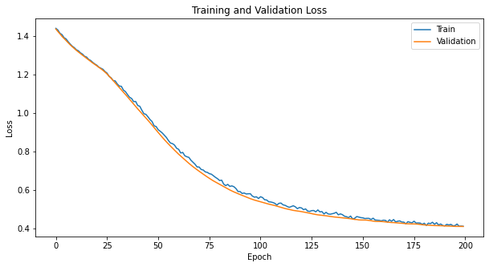
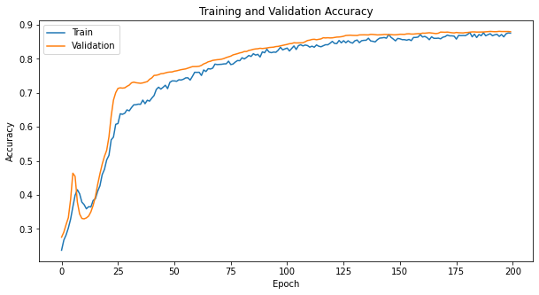
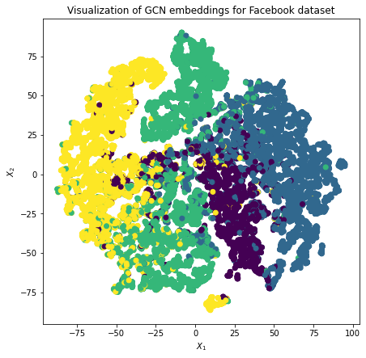

# Multi-layer GCN on Facebook Large Page-Page Network Dataset

## Introduction to GCN:
Multi-layer GCN is a type of neural network specifically designed for graph-structured data, where nodes represent entities and edges represent relationships between these entities. This neural network can be used to perform various tasks on graph dataset, such as node classification, link prediction, or clustering.
- Input Layer: Takes node features and the adjacency matrix as inputs.
- Hidden Layers: Each layer performs a graph convolution operation, aggregating information from the neighboring nodes. The depth (number of layers) depends on the complexity of the task.
- Output Layer: For tasks like node classification, this layer produces a label prediction for each node. For link prediction, this layer could output the probability of an edge between pairs of nodes.

## Implementation:
1. Create N by N adjacency matrix (N is nodes number)
2. Create N by D matrix (D is features number)
3. Normalize the adjacency and the features matrix
4. Create a Two Layer Graph Convolutional Network model
5. Train & test the dataset

## Dependencies Required:
- Python
- Numpy
- Pytorch
- Matplotlib
- Sklearn
- Scipy
- Pandas

## Results:
#### Loss Plot

#### Training Plot

#### Node embeddings

## References:
[1] https://arxiv.org/abs/1609.02907

## Notes:
- .env: Storage key and secret
- endpoint: http://localhost:5000
